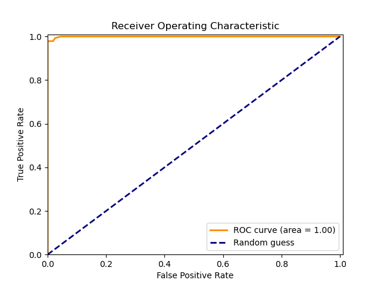

# Attrition Analysis Report

## 1. Introduction
Employee attrition, the phenomenon of employees leaving an organization, presents a multifaceted challenge for businesses across industries. Understanding the underlying factors driving attrition is crucial for organizations to mitigate its negative impacts on productivity, morale, and financial performance. This report aims to delve into the intricacies of employee attrition within ABC, a leading telecommunications company, and provide actionable insights to address this issue effectively.

### Context

ABC, with its workforce of approximately 4000 employees, operates within a dynamic and competitive industry landscape. However, it faces the persistent challenge of high attrition rates, with approximately 15% of employees leaving the organization annually. This attrition rate not only disrupts project timelines but also imposes significant resource burdens on the company's recruitment department. Moreover, the onboarding process for new staff members compromises work productivity and effectiveness, necessitating a comprehensive understanding of the underlying causes of attrition.

### Objective

The primary objective of this analysis is to identify the key factors contributing to employee attrition within ABC and develop a predictive model to anticipate and prevent future attrition. By leveraging historical employee data, we aim to uncover patterns, trends, and insights that can inform strategic decision-making and enable proactive interventions to reduce attrition rates.

## 2. Data Collection
To conduct this analysis, we collected data from various sources within ABC, including HR records, employee and manager surveys. The dataset consists of information on employee demographics, job characteristics and performance metrics. Raw data consisted of multiple different data types, including categorical, numerical, and text data. We preprocessed the data by cleaning, transforming, and encoding it into a format suitable for analysis and modeling.

## 3. Exploratory Data Analysis
Before diving into the predictive modeling, we performed exploratory data analysis (EDA) to gain insights into the dataset. This involved examining the distribution of variables and identifying any missing values or outliers. The missing values were imputed using appropriate techniques, and we visualized the relationships between different variables using plots such as histograms, scatter plots, and correlation matrices.

This first thing to notice is the imbalance in the target variable, with a higher proportion of employees who stayed compared to those who left. This imbalance can affect the performance of the predictive model if not addressed properly. So we used performance metrics such as precision, recall, and F1 score to evaluate the model's performance accurately. 

The f1 score is a harmonic mean of precision and recall, given by the following formula:
$$ F1 = 2 * \frac{precision * recall}{precision + recall} .$$

### Key Findings

Both models (decision tree and random forest) performed well in terms of f1 score, recall, and precision. These predictive models can be used to anticipate employee attrition and identify the key factors driving it and following gives a brief overview of the performance metrics of the models:

#### Decision Tree Model
Confusion Matrix:

Roc Curve and precision-recall curve:

  
  

Both the ROC curve and precision-recall curve show that the decision tree model performs well in distinguishing between employees who stayed and those who left.

#### Random Forest Model
Confusion Matrix:

Roc Curve and precision-recall curve:

  
  

These figures show that the random forest model slightly outperforms the decision tree model in terms of precision, recall, and f1 score. However, the difference in performance between the two models is not significant, and both models can effectively predict employee attrition. 

