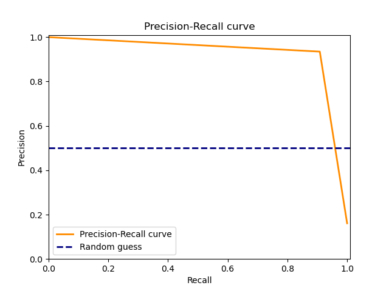
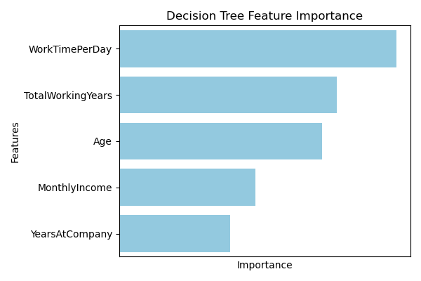
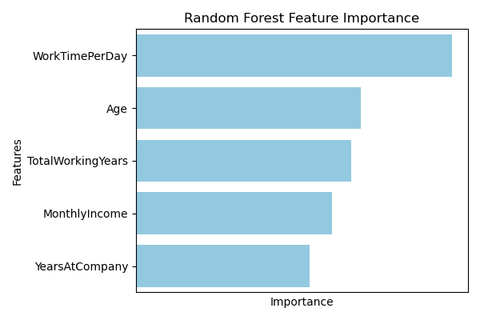

# Attrition Analysis Report

## 1. Introduction
Employee attrition, the phenomenon of employees leaving an organization, presents a multifaceted challenge for businesses across industries. Understanding the underlying factors driving attrition is crucial for organizations to mitigate its negative impacts on productivity, morale, and financial performance. This report aims to delve into the intricacies of employee attrition within ABC, a leading telecommunications company, and provide actionable insights to address this issue effectively.

### Context

ABC, with its workforce of approximately 4000 employees, operates within a dynamic and competitive industry landscape. However, it faces the persistent challenge of high attrition rates, with approximately 15% of employees leaving the organization annually. This attrition rate not only disrupts project timelines but also imposes significant resource burdens on the company's recruitment department. Moreover, the onboarding process for new staff members compromises work productivity and effectiveness, necessitating a comprehensive understanding of the underlying causes of attrition.

### Objective

The primary objective of this analysis is to identify the key factors contributing to employee attrition within ABC and develop a predictive model to anticipate and prevent future attrition. By leveraging historical employee data, we aim to uncover patterns, trends, and insights that can inform strategic decision-making and enable proactive interventions to reduce attrition rates.

## 2. Data Collection
To conduct this analysis, we collected data from various sources within ABC, including HR records, employee and manager surveys. The dataset consists of information on employee demographics, job characteristics and performance metrics. Raw data consisted of multiple different data types, including categorical, numerical, and text data. We preprocessed the data by cleaning, transforming, and encoding it into a format suitable for analysis and modeling.

## 3. Exploratory Data Analysis
Before diving into the predictive modeling, we performed exploratory data analysis (EDA) to gain insights into the dataset. This involved examining the distribution of variables and identifying any missing values or outliers. The missing values were imputed using appropriate techniques, and we visualized the relationships between different variables using plots such as histograms, scatter plots, and correlation matrices.

This first thing to notice is the imbalance in the target variable, with a higher proportion of employees who stayed compared to those who left. This imbalance can affect the performance of the predictive model if not addressed properly. So we used performance metrics such as precision, recall, and F1 score to evaluate the model's performance accurately. 

The f1 score is a harmonic mean of precision and recall, given by the following formula: $$F1 = 2 * \frac{\rm{precision} * \rm{recall}}{\rm{precision} + \rm{recall}}.$$
Precision gives the ratio of true positives to the sum of true positives and false positives, while recall gives the ratio of true positives to the sum of true positives and false negatives. The f1 score provides a balanced measure of the model's performance, considering both precision and recall.

### Inintial Data Analysis
Initial data analysis revealed several key insights into how attrition might be influenced by various factors such age, salary, daily work hours and percentage salary increase. These insights gives us an initial understanding of the dataset and help us identify potential predictors of attrition before delving into the predictive modeling phase.

  
  

  
  

This analysis provides a foundation for developing predictive models to anticipate employee attrition and identify the key factors driving it. When you look at the plots above, you can see that the age distribution is skewed to the right, with a higher proportion of younger employees. The monthly income distribution is left-skewed, with most employees earning between 20000 and 80000. The average daily work hours distribution is normally distributed, with most employees working between 6 and 10 hours per day. The percentage salary hike distribution is right-skewed, with most employees receiving a salary hike between 10% and 20%.

The percentage salary hike is the only counterintuitive variable in the dataset, as one would expect the mean  salary hike of employees who stayed at the company to be higher than those who left. However, the data shows that employees who left the company received a higher percentage salary hike on average compared to those who stayed. This could be due to various reasons, such as employees leaving due to dissatisfaction with their current salary which in turn leads to a higher percentage salary hikes.

### Key Findings

Both models (decision tree and random forest) performed well in terms of f1 score, recall, and precision, but the random forest model outperformed the decision tree model slightly. These predictive models can be used to anticipate employee attrition and identify the key factors driving it and following gives a brief overview of the performance metrics of the two models:

#### Decision Tree Model
Confusion Matrix:

Roc Curve and precision-recall curve:

  
  

Both the ROC curve and precision-recall curve show that the decision tree model performs well in distinguishing between employees who stayed and those who left.

#### Random Forest Model
Confusion Matrix:

Roc Curve and precision-recall curve:

  
  

These figures show that the random forest model performs almost perfectly in distinguishing between employees who stayed and those who left. The ROC curve and precision-recall curve show that the random forest model has high true positive rates and low false positive rates, indicating that it can accurately predict employee attrition. Even though the random forest model outperformed the decision tree model, both models provide valuable insights into the key factors driving employee attrition.

### Feature Importance

The feature importance plots for the decision tree and random forest models offer insights into the factors driving employee attrition. Both models converge on common factors contributing significantly to attrition, as depicted below:

  
  

While slight variations exist between the models, they identify consistent drivers of attrition. Notably, attributes such as average time spent in the office, monthly income, job satisfaction, age, and tenure at the company emerge as influential factors. These insights inform HR strategies to proactively address attrition by focusing on these key drivers.

Both models highlight the paramount importance of average time spent daily in the office as the leading factor impacting attrition. This underscores the significance of promoting work-life balance and flexible arrangements to retain employees. Additionally, emphasis is placed on monthly income, total tenure, and age, indicating the importance of competitive compensation and age-tailored benefits for retention.

In the initial data analysis, we observed that the percentage salary hike was higher for employees who left compared to those who stayed. This counterintuitive finding underscores the importance of aligning compensation strategies with employee expectations and industry standards to prevent attrition. By leveraging these insights, ABC can develop targeted retention strategies, enhance employee engagement, and foster a supportive work environment to mitigate attrition risks effectively.

Furthermore, the initial data analysis revealed that the time spent daily in the office is slightly higher for employees who left compared to those who stayed. This finding underscores the importance of promoting work-life balance, flexible work arrangements, and wellness programs to enhance employee satisfaction and retention. By addressing these key factors driving attrition, ABC can develop data-driven HR strategies, optimize employee engagement, and reduce attrition rates effectively.

## 4. Recommendations

Based on the insights derived from the predictive models and feature importance analysis, we propose the following recommendations to address employee attrition within ABC effectively:

1. **Enhance Work-Life Balance:** Implement flexible work arrangements, remote work options, and wellness programs to promote work-life balance and employee well-being. Encourage employees to maintain a healthy work-life balance by providing opportunities for personal development, stress management, and work-life integration.

2. **Optimize Compensation and Benefits:** Review and adjust compensation packages, performance incentives, and benefits to align with industry standards and employee expectations. Offer competitive salaries, performance-based bonuses, and tailored benefits to attract and retain top talent.

3. **Promote Career Development:** Provide opportunities for career advancement, skill development, and training to enhance employee engagement and retention. Implement mentorship programs, leadership training, and career progression pathways to empower employees and foster professional growth.

4. **Strengthen Employee Engagement:** Foster a positive work culture, open communication, and employee recognition to enhance engagement and morale. Encourage feedback, recognition, and team-building activities to create a supportive work environment and boost employee satisfaction.

5. **Implement Attrition Prediction System:** Develop an attrition prediction system using machine learning models to anticipate and prevent employee attrition. Leverage historical data, predictive analytics, and employee feedback to identify attrition risk factors and proactively address them.

We also recommend following best practices to enhance the data analysis and modeling process:

1. **Data Collection and Integration:** Streamline data collection processes, integrate data from multiple sources, and ensure data quality and consistency. Implement data governance practices, data validation checks, and data integration tools to enhance data accuracy and reliability.

2. **Data Preprocessing and Feature Engineering:** Standardize data preprocessing pipelines, automate feature engineering tasks, and optimize data transformation processes. Leverage data preprocessing libraries, feature selection techniques, and data normalization methods to enhance data quality and model performance.

3. **Model Training and Evaluation:** Develop robust machine learning models, tune hyperparameters, and evaluate model performance using appropriate metrics. Implement cross-validation techniques, hyperparameter tuning algorithms, and model evaluation frameworks to optimize model accuracy and generalization.